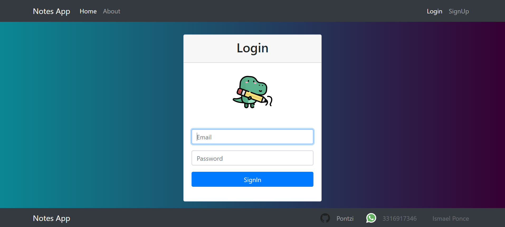
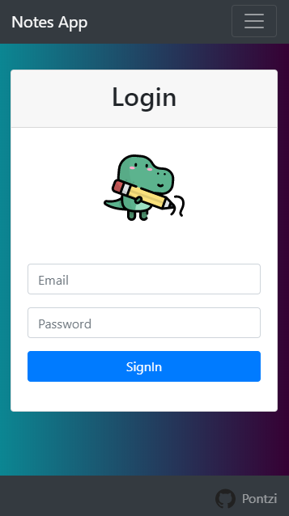

# Notes app to save your personal notes!

Implemented with Node.js, MongoDB and Express

## Requeriments

Node.js installed
MongoDB installed

## How does it work?

- `npm install` to install all dependencies.
- `in a command window execute mongod`.
- `in another command window execute npm run dev` to open development mode.
